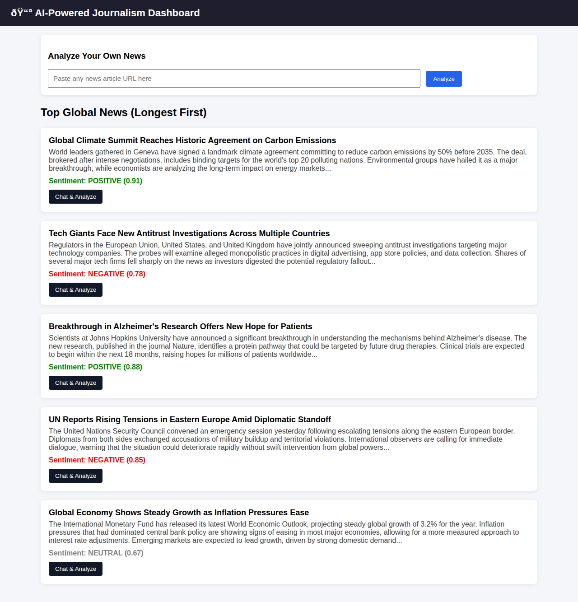
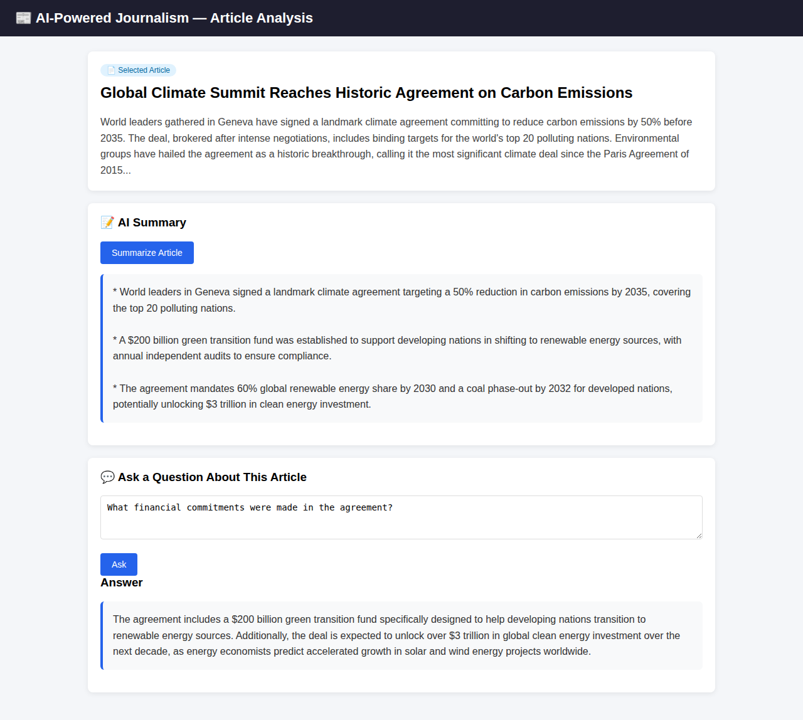
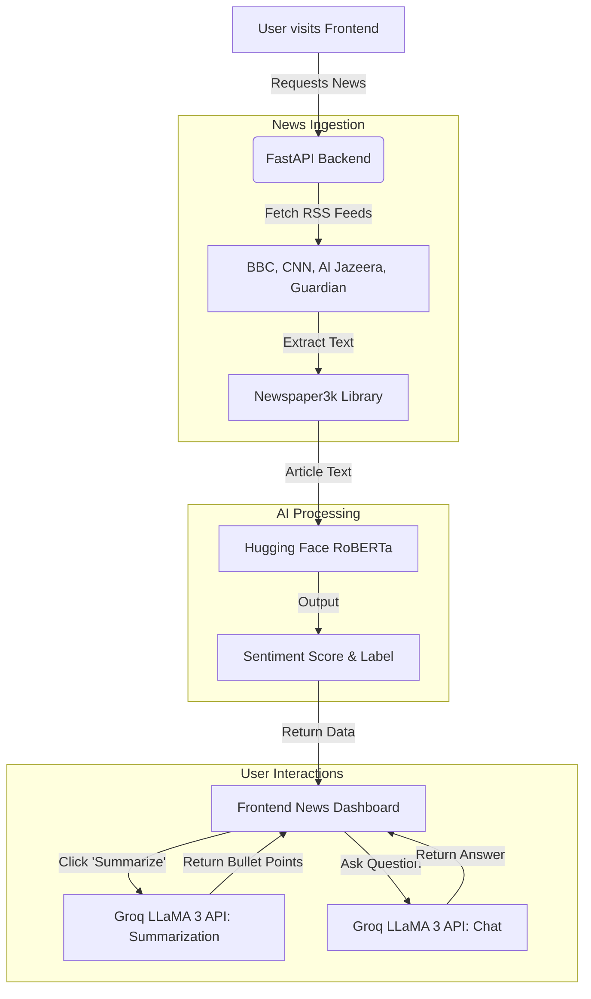

# AI-Powered Journalism

Welcome to the **AI-Powered Journalism** platform! This application revolutionizes the way users consume news by leveraging advanced Artificial Intelligence to scrape, analyze, summarize, and interact with global news articles in real-time.

## 📸 Screenshots

### News Dashboard

### Article Chat & Analysis

## 🌟 Overview

The AI-Powered Journalism app provides a streamlined, intelligent feed of current world news. By aggregating articles from top global publishers (BBC, CNN, Al Jazeera, The Guardian), the application automates sentiment analysis to give you a quick read on the emotional tone of the news. Furthermore, it integrates cutting-edge Large Language Models (LLMs) to automatically summarize lengthy articles and offers an interactive chat interface to ask specific questions about the news content.

### ✨ Key Features

- **Automated News Aggregation:** Scrapes Top RSS Feeds globally to give users a unified view of major headlines.
- **Real-Time Sentiment Analysis:** Uses Hugging Face's `RoBERTa` model to categorize each article's sentiment as Positive, Neutral, or Negative.
- **AI Bullet-Point Summarization:** Leverages the Groq API and LLaMA 3 (70B) to condense long articles into quick, digestible bullet points.
- **Interactive Article Chat:** Context-aware Q&A! Chat directly with the article to ask specific questions and extract exact details using LLMs.
- **Custom Article Ingestion:** Paste any custom news URL to parse its content instantly.

## 🔄 Application Workflow

The following diagram illustrates the complete workflow of the application, from fetching data to user interaction.

## 🧠 How It Works

1. **News Scraping Engine**:
   When the user loads the dashboard, the backend queries various major RSS feeds using `feedparser`. To ensure high performance, it limits the ingestion to top articles and parses them using the `newspaper3k` library.

2. **Sentiment Analysis**:
   Once text is extracted, it is passed through a pre-trained `cardiffnlp/twitter-roberta-base-sentiment` pipeline. This provides an instant label (Positive, Neutral, Negative) and confidence score, helping readers gauge the tone of the article before reading it.

3. **AI Summarization**:
   If a user opts to summarize an article, its raw text is sent to the Groq API via a prompt tailored for LLaMA 3. The LLM streams back a concise 3-bullet-point summary.

4. **Conversational News**:
   Providing interactive reading, users can type questions about an article. The backend dynamically constructs a contextual prompt containing the article text and the user's question, passing it to the Groq LLM for real-time answers.

## 🛠️ Technology Stack

- **Backend:** Python, FastAPI
- **AI/ML:** Hugging Face Transformers (`RoBERTa`), Groq API (`LLaMA 3 70B`)
- **Web Scraping:** Newspaper3k, Feedparser
- **Frontend:** HTML, CSS, JavaScript (via FastAPI Templates)